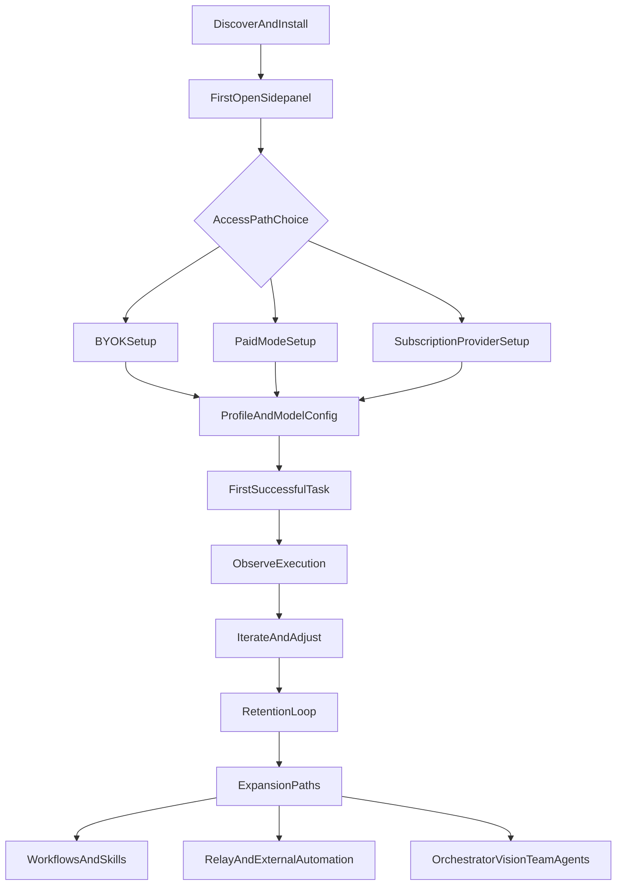

## 1) Product frame (as-built)

Parchi is a **chat-driven browser automation copilot** that lives in the browser sidepanel. Users can ask it to read pages, navigate, click, type, scroll, screenshot, extract data, and manage tabs—while seeing runtime state (plan, tool timeline, reasoning, status) as it works.

**Important structural truth:** the UX is “operator-first” and assumes users are willing to configure providers/models, reason about permissions, and recover from failures. This is explicit in the repo’s warning-heavy positioning and dense sidepanel surface ([`README.md`](../../README.md), [`docs/reports/05-devex-ux-assessment-2026-03-12.md`](./05-devex-ux-assessment-2026-03-12.md)).

## 2) Primary personas (internal model)

- **Evaluator/New installer**
  - Wants to “see it work” quickly and safely.
  - Lowest tolerance for configuration complexity and unclear state transitions.
- **Self-serve BYOK user**
  - Comfortable pasting an API key / endpoint and selecting models.
  - Wants predictable costs/latency and easy profile switching.
- **Managed account user (paid mode)**
  - Wants “no keys, just works.”
  - Must pass through sign-in + billing activation + paid model selection gates.
- **Subscription router user (OAuth subscription providers via proxy)**
  - Wants to reuse an existing AI subscription via an OpenAI-compatible endpoint or built-in OAuth provider routing.
  - High sensitivity to “it’s connected but not actually usable” states.
- **Operator / automation builder**
  - Uses workflows/skills, recording, relay daemon/CLI, Electron agent, orchestration, team agents.
  - Accepts complexity in exchange for control, observability, and capability.

## 3) One lifecycle map (stages + branches)

This is the **single product journey** with explicit branch points, rather than a tour of screens.

### 3.1 Stage: Discover & install

- **Entry points**
  - Repo/README install instructions and warnings ([`README.md`](../../README.md))
- **User goal**
  - Get the extension running and visible in the browser.
- **Success**
  - Sidepanel opens, chat composer is available, starter prompts visible ([`packages/extension/sidepanel/templates/main.html`](../../packages/extension/sidepanel/templates/main.html)).
- **Common failure modes**
  - Build/install friction, unclear “dist/” expectation, Firefox temporary load complexity.

### 3.2 Stage: First open (sidepanel shell)

Sidepanel shell provides the “mental model” and sets expectations:
- **Topbar**: history, new session, settings.
- **Chat empty state**: starter prompts (“What’s on this page?”, “Find something across my tabs”, etc.).
- **Plan drawer**: visible execution structure.
- **Composer tools**: attach file, record context, select tabs, export ([`packages/extension/sidepanel/templates/main.html`](../../packages/extension/sidepanel/templates/main.html)).

### 3.3 Stage: Access path choice (primary branch)

The product effectively has three access lanes:

1) **BYOK / direct API key** (keys stored locally)
2) **Paid mode / managed account** (sign-in + Stripe metered billing + managed routing)
3) **Subscription providers** (connect existing subscriptions, no API keys, often device-code flow)

These are visible in the Settings provider surface ([`packages/extension/sidepanel/templates/panels/settings-general.html`](../../packages/extension/sidepanel/templates/panels/settings-general.html)) and reinforced by the in-chat “setup access” button label logic ([`packages/extension/sidepanel/ui/account/account-setup-state.ts`](../../packages/extension/sidepanel/ui/account/account-setup-state.ts)).

#### Branch: BYOK setup

- **User goal**
  - Add provider key, base URL if needed, and a model id.
- **Options**
  - Built-in providers, custom providers, SDK type (OpenAI-compatible vs Anthropic-compatible).
- **Success**
  - At least one configured profile with model + valid auth path (`apiKey` or `*-oauth` provider).

#### Branch: Paid mode setup

- **User goal**
  - “No keys” managed routing through Parchi.
- **Required gates**
  - Convex backend configured in build
  - Sign in (email/password or Google/GitHub)
  - Choose paid model/profile
  - Activate Stripe billing
- **Success**
  - Paid “setup complete” state and non-error runtime status ([`packages/extension/sidepanel/templates/panels/account.html`](../../packages/extension/sidepanel/templates/panels/account.html), [`packages/extension/sidepanel/ui/account/account-setup-state.ts`](../../packages/extension/sidepanel/ui/account/account-setup-state.ts)).

#### Branch: Subscription provider setup

- **User goal**
  - Connect an existing subscription and route it as an OpenAI-compatible endpoint.
- **Required gates**
  - OAuth connection / device-code completion.
- **Success**
  - Provider shows connected and a usable model can be selected.

### 3.4 Stage: Profile & model config (secondary branch)

Once access exists, the user must still land a workable execution profile:

- **Model selection**
  - Active profile selection in the composer (“Switch profile”) and model selector grid ([`packages/extension/sidepanel/templates/main.html`](../../packages/extension/sidepanel/templates/main.html), [`packages/extension/sidepanel/templates/panels/settings-general.html`](../../packages/extension/sidepanel/templates/panels/settings-general.html)).
- **Generation defaults (capability toggles)**
  - screenshots on/off, “send as images”, streaming, reasoning visibility, confirm actions, save history, completion ping ([`packages/extension/sidepanel/templates/panels/settings-general.html`](../../packages/extension/sidepanel/templates/panels/settings-general.html)).

**Implicit product truth:** “first success” is gated not just by keys/sign-in, but by selecting a model + enabling the right capabilities for the task.

### 3.5 Stage: First successful task (core value moment)

The empty-state prompts define the intended first win:
- Understand the current page
- Summarize key points
- Search across tabs
- Help fill out a form
- Extract data into a table

Success here means: the agent produces a useful answer *and/or* performs safe automation while the user can observe state transitions (plan/tool timeline/status).

### 3.6 Stage: Observe execution (trust loop)

Parchi is strongest when users can see what’s happening:
- Plan drawer + checklist pattern (execution clarity)
- Tool timeline / tool rows (action trace)
- Reasoning stream (optional)
- Status surface (active/warning/error)

These surfaces are part of the sidepanel runtime shape described in [`docs/agent-pipeline.md`](../agent-pipeline.md) and the UX assessment’s “exposes useful state” section ([`docs/reports/05-devex-ux-assessment-2026-03-12.md`](./05-devex-ux-assessment-2026-03-12.md)).

### 3.7 Stage: Iterate & adjust (config/behavior tuning)

After the first run, users typically:
- Toggle **confirm actions** if they want more safety.
- Toggle **screenshots** and **send as images** if extraction/vision is weak.
- Adjust **context limit / max tokens / timeout** if tasks truncate or time out.
- Switch **profiles** to trade latency vs quality.

### 3.8 Stage: Retention loop (repeat usage)

Retention features anchor repeat work:
- **History** (persist/restore sessions) ([`packages/extension/sidepanel/ui/history/panel-history.ts`](../../packages/extension/sidepanel/ui/history/panel-history.ts))
- **Export chat** (with traces/files) ([`packages/extension/sidepanel/ui/chat/panel-export.ts`](../../packages/extension/sidepanel/ui/chat/panel-export.ts))
- **Usage** (per-model and per-session stats) ([`packages/extension/sidepanel/templates/panels/settings-usage.html`](../../packages/extension/sidepanel/templates/panels/settings-usage.html))

### 3.9 Stage: Expansion paths (operator-grade power)

The product grows into advanced/operator usage through these routes:

- **Workflows**
  - Create/choose reusable “workflows” invoked from chat (menu + keyboard + CRUD) ([`packages/extension/sidepanel/ui/chat/panel-workflows.ts`](../../packages/extension/sidepanel/ui/chat/panel-workflows.ts)).

- **Recording → context → skill**
  - Record in-browser actions, review them (actions + screenshots), attach to the chat or save as a skill ([`packages/extension/sidepanel/ui/chat/panel-recorder.ts`](../../packages/extension/sidepanel/ui/chat/panel-recorder.ts)).

- **Mission Control / subagents**
  - Operate delegated subagents from a dedicated control panel (“Mission Control”) ([`packages/extension/sidepanel/templates/main.html`](../../packages/extension/sidepanel/templates/main.html), [`packages/extension/sidepanel/styles/mission-control.css`](../../packages/extension/sidepanel/styles/mission-control.css)).

- **Advanced settings (safety + operator tooling)**
  - Orchestrator + role profiles (orchestrator/vision)
  - Team agents
  - Tool permissions (read/interact/navigate/tabs/screenshots)
  - Allowed domains allowlist
  - Skills library management
  - Relay enable + URL/token + connection status
  - Danger zone resets
  - Display controls (theme/zoom/typography)
  - Source: [`packages/extension/sidepanel/templates/panels/settings-advanced.html`](../../packages/extension/sidepanel/templates/panels/settings-advanced.html)

- **Relay daemon / CLI / Electron**
  - Externalize execution as a local automation endpoint; optionally control Electron apps ([`README.md`](../../README.md), and adjacent surfaces referenced in [`docs/agent-pipeline.md`](../agent-pipeline.md)).

## 4) Option/branch matrix (what users can choose)

### 4.1 Access & billing branches

- **Access mode**
  - BYOK (local API key)
  - Subscription provider (OAuth/device code)
  - Paid mode (Convex + sign-in + Stripe)
- **Paid runtime readiness** (paid mode only)
  - backend unavailable → sign-in required → model missing → billing inactive → runtime error/degraded → active
  - encoded explicitly in the setup-state label logic ([`packages/extension/sidepanel/ui/account/account-setup-state.ts`](../../packages/extension/sidepanel/ui/account/account-setup-state.ts)).

### 4.2 Safety & permissions branches

- **Confirm actions** toggle (safety posture)
- **Tool permission classes** (operator control)
- **Allowed domains** allowlist
- **Screenshots / send as images** toggles (capability + privacy posture)

### 4.3 Capability & UX preference branches

- Streaming on/off
- Reasoning on/off
- Save history on/off
- Theme / typography / zoom
- Timeout/context/token limits

### 4.4 Workflow persistence branches

- Ad-hoc prompting vs saved workflows
- Recording attached vs saved as skill vs discarded
- Export with traces/files vs simple transcript

## 5) Use-case catalog (grouped by user intent)

- **Read/understand**
  - Summarize page, explain what’s on the page, extract key points.
- **Extract/transform**
  - Pull structured data into a table, turn page into a checklist, compile citations.
- **Search/compare**
  - Find content across tabs; compare multiple pages.
- **Act safely**
  - Fill forms, click through flows with confirm actions + visible tool timeline.
- **Augment context**
  - Attach files; select relevant tabs; record a “ground truth” action trace.
- **Operationalize**
  - Save workflows; build a skills library; use mission control for delegated sessions.
- **Integrate externally**
  - Relay daemon/CLI; Electron control; scripts driving Parchi as an automation endpoint.

## 6) Friction inventory (as-built) + opportunity areas

Grounded in the current UX assessment and surfaced branch points:

- **Overlapping action surfaces** (powerful, but cognitively noisy)
  - Empty-state starters + FABs + settings entry points + mission control overlay can feel like multiple UI systems.
  - See UX assessment “overlapping action surfaces” and “state transitions not always obvious” ([`docs/reports/05-devex-ux-assessment-2026-03-12.md`](./05-devex-ux-assessment-2026-03-12.md)).

- **Discoverability vs density tension**
  - Advanced settings (Look & Feel, relay, skills, permissions) live inside collapsibles; compact but hidden.
  - User consequence: “I didn’t know this existed” or “I can’t find the thing I changed.”
  - Source: [`packages/extension/sidepanel/templates/panels/settings-advanced.html`](../../packages/extension/sidepanel/templates/panels/settings-advanced.html).

- **Setup is multi-gated**
  - “Access is configured” ≠ “a runnable profile exists” ≠ “capabilities enabled” ≠ “runtime ready.”
  - Setup button label tries to reflect this, but it’s still stateful and easy to misread.
  - Source: [`packages/extension/sidepanel/ui/account/account-setup-state.ts`](../../packages/extension/sidepanel/ui/account/account-setup-state.ts).

- **Paid mode has many failure states**
  - Backend missing, signed out, billing inactive, model missing, runtime degraded/error.
  - Opportunity: unify into one “paid readiness checklist” with a single recovery flow.

- **Operator features are powerful but not clearly “optional”**
  - Orchestrator/vision/team agents/relay/skills library/mission control can feel like requirements rather than expansions.
  - Opportunity: explicit “Core vs Operator” partitioning and progressive disclosure.

## 7) Recommended UX priorities (Must/Should/Could/Won’t yet)

### Must

- **Unify the right-panel interaction model**
  - Settings/account/history/tab-selection should feel like one coherent shell with predictable transitions (matches UX assessment priority).

- **Rationalize action surfaces**
  - Reduce overlap between quick actions, FAB/overlays, and panel entry points.
  - Goal: fewer competing “ways to do the same thing,” clearer hierarchy.

- **Make setup progress legible**
  - Turn access/profile/capabilities readiness into a single checklist that answers: “What’s blocking my next successful run?”

### Should

- **Improve advanced discoverability without dumping everything open**
  - Keep density, but add strong navigation/spotlight patterns (e.g., pinned “Advanced” index, search, or “recently changed”).

- **Clarify safety posture**
  - Make the relationship between confirm actions, tool permissions, allowed domains, and screenshots explicit in one place.

### Could

- **Promote ‘recording’ as an onboarding accelerator**
  - “Show me what you did” → record → attach context → first success with less prompt engineering.

- **Treat Mission Control as an “operator mode”**
  - Clear toggle/labeling that it’s a power feature, not a required core control.

### Won’t yet (until core is simplified)

- **Add more provider types / more orchestration roles**
  - The current surface area is already large; prioritize reducing ambiguity first.
